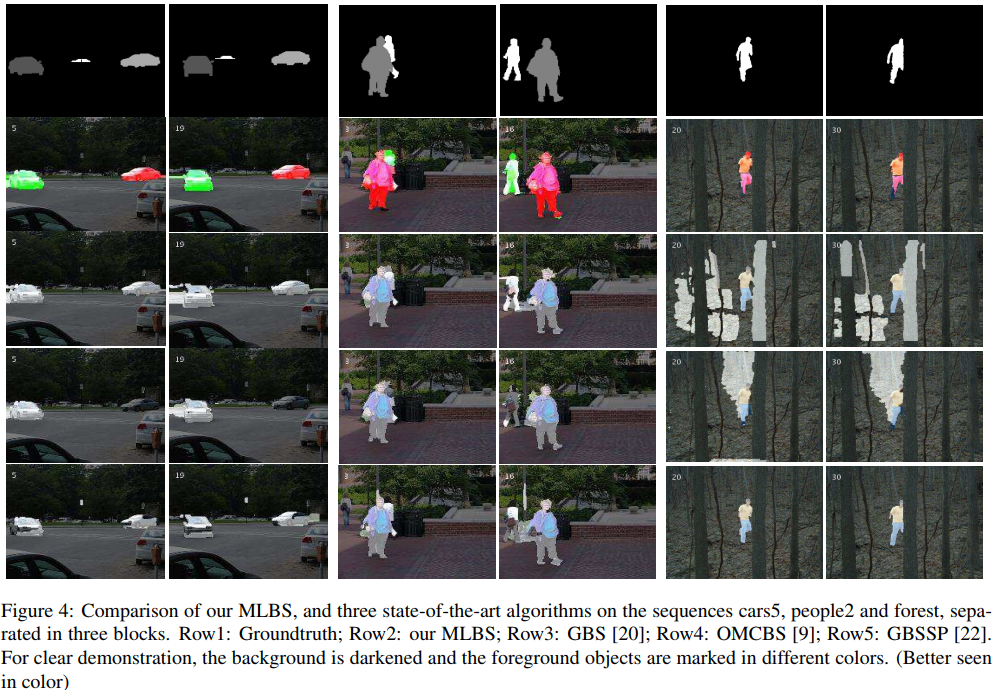

# MultilayerBSMC

This is an implementation of "A Multilayer-Based Framework for Online Background Subtraction with Freely Moving Cameras" ICCV'17 with Matlab. 

# Data
Test Dataset: cars1~8, people1, people2 from [Berkeley Motion Segmentation Dataset (BMS-26)](http://lmb.informatik.uni-freiburg.de/resources/datasets/moseg.en.html) 

Put the testing data to the folder './Data/moseg_dataset/'  
To prepare the data, you need to convert the images to 'ppm' format, and prepare addtional 'XXX.bmf' file.  
The example is shown in 'cars1'.
# Optical Flow
The optical flow I am using is pretty slow. To speed up, you are suggested to use faster deep-learning-based method. OR you can  directly use the trajectory-generating methods.   
I will add it to my TODO list.

# Code 
To run the code, check "runHopkins.m".   

# Result from paper

